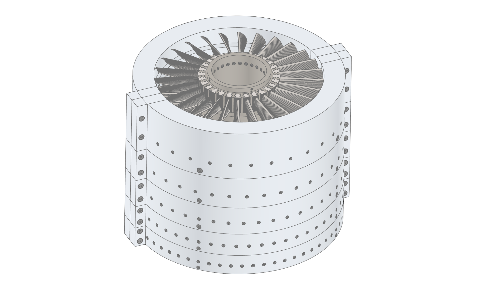
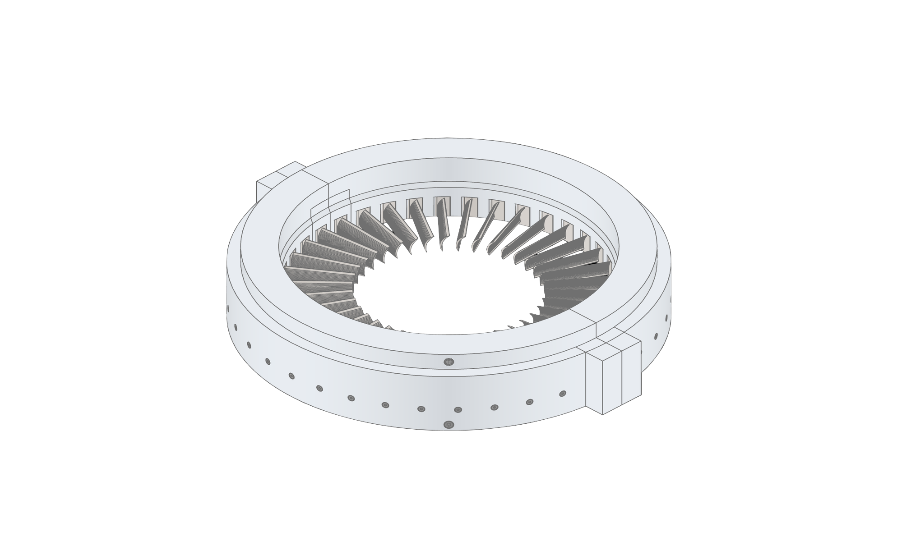
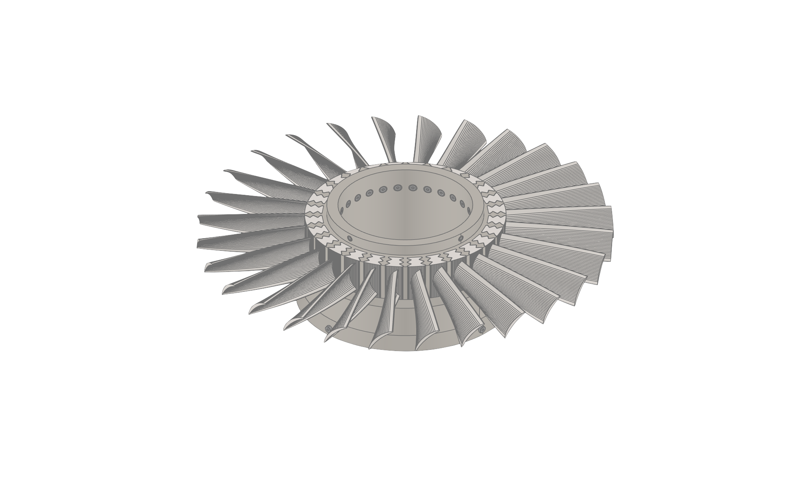

# TurboDesigner
The open-source turbomachinery designer

<table>
  <tr>
    <td align="center"><br/>Axial Compressor</td>
    <td align="center"><br/>Axial Casing</td>
    <td align="center"><br/>Axial Rotor</td>
  </tr>
</table>

## About

TurboDesigner is a parametric turbomachinery design tool that takes high-level thermodynamic inputs (pressure ratio, mass flow rate, RPM, etc.) and produces:

1. **Mean-line thermodynamic analysis** — stage-by-stage temperature, pressure, and velocity calculations
2. **Blade flow analysis** — spanwise velocity distributions via free-vortex theory, metal angle computation with empirical deviation correlations
3. **3D CAD geometry** — fully parametric blade, shaft, and casing models exported as STEP files

Currently focused on **axial compressors**, with plans to support axial turbines and turbopumps for liquid rocket engines.

## Architecture

| Module | Description |
|--------|-------------|
| `Turbomachinery` | Top-level compressor model: overall pressure ratio, efficiency, stage count, inlet conditions |
| `Stage` | Single compressor stage: temperature rise, reaction, rotor + stator blade rows |
| `FlowStation` | Thermodynamic state at a station: total/static T & P, velocity triangles, Mach number, density |
| `BladeRow` | Blade row geometry: aspect ratio, solidity, metal angles, airfoil profiles at multiple span stations |
| `Vortex` | Spanwise velocity distribution (currently Free Vortex: $r \cdot c_\theta = \text{const}$) |
| `MetalAngles` | Blade metal angle data: incidence, deviation, camber, and stagger (computed by Johnsen-Bullock or equals-flow-angles methods) |

### CAD Modules

| Module | Description |
|--------|-------------|
| `AxialCompressorCadModel` | Full CAD assembly orchestrator: builds shaft + casing in parallel via multiprocessing |
| `ShaftCadModel` | Shaft/disk stage geometry: rotor disk, blade slots, stage-connect fastener holes |
| `CasingCadModel` | Outer casing stage geometry: casing shell, stator blade slots, clamp fastener holes |
| `BladeCadModel` | Single blade row: lofted 3D airfoil with optional fir-tree root attachment |
| `BillOfMaterials` | Part list generation: fasteners, blades, disks, casings with quantities per stage |


## Features

- **Vortex methods:** Free Vortex (constant work distribution)
- **Airfoil types:** NACA 65 series, Double Circular Arc (DCA/C4)
- **Deviation models:** Johnsen-Bullock empirical correlation, zero-deviation (metal = flow angles)
- **CAD generation:** Lofted 3D blades, shaft/disk, outer casing with clamps, fir-tree blade root attachments
- **Parallel CAD builds:** Multiprocessing with tessellation caching for fast iteration
- **CLI:** Full command-line interface for design management, analysis, and CAD export
- **JSON analysis export:** Auto-serialization with unit metadata annotations

## Assumptions

* Ideal gas thermodynamic model
* Constant mean-line radius (set by hub-to-tip ratio)
* Blade calculations based on the mean radius station
* Free vortex spanwise distribution (more methods planned)
* Airfoil geometry limited to DCA and NACA 65 profiles

## Installation

```bash
pip install turbodesigner
```

### CAD Geometry Support

CAD commands (`turbodesigner cad ...`) require CadQuery, which depends on the OpenCASCADE kernel. If your system already has a compatible CadQuery installed, add it as an extra:

```bash
pip install "turbodesigner[cq]"
```

Otherwise, install CadQuery via conda first (recommended — handles the native OCC dependency):

```bash
# Install CadQuery (required for CAD geometry support)
conda install -c conda-forge -c cadquery cadquery=master

pip install turbodesigner
```

### Development Setup

```bash
git clone --recurse-submodules https://github.com/OpenOrion/turbodesigner.git
cd turbodesigner
pip install -e ".[test,cq]"
```

## Design Input

Designs are defined as JSON files with the following structure:

```json
{
  "machine_type": "axial",
  "configuration": "compressor",
  "definition": {
    "gamma": 1.4,
    "axial_velocity": 136,
    "rpm": 10000,
    "gas_constant": 287,
    "mass_flow_rate": 4.37,
    "pressure_ratio": 3.0,
    "inlet_total_pressure": 101000,
    "inlet_total_temperature": 288,
    "isentropic_efficiency": 0.878,
    "num_stages": 5,
    "stage_temperature_rise": "equal",
    "stage_reaction": [0.5, 0.5, 0.5, 0.5, 0.5],
    "inlet_blockage": 0.0,
    "outlet_blockage": 0.0,
    "hub_to_tip_ratio": 0.5,
    "num_streams": 9,
    "aspect_ratio": {"rotor": 3.0, "stator": 3.25},
    "spacing_to_chord": {"rotor": 1.0, "stator": 1.0},
    "max_thickness_to_chord": {"rotor": 0.1, "stator": 0.1},
    "row_gap_to_chord": 0.25,
    "stage_gap_to_chord": 0.5
  }
}
```

Per-stage arrays are supported for non-uniform designs (e.g., higher reaction at inlet stages, variable aspect ratios).

## CLI Usage

TurboDesigner includes a Click-based CLI for design management, analysis, and CAD generation:

```bash
# Design management
turbodesigner axial compressor design create <name> --from <json>
turbodesigner axial compressor design list
turbodesigner axial compressor design show <name>
turbodesigner axial compressor design export <name> <path>
turbodesigner axial compressor design schema          # Print the JSON schema
turbodesigner axial compressor design report           # Generate analysis report

# Analysis (requires an active design via `design use <name>`)
turbodesigner axial compressor analyze machine         # Overall machine parameters
turbodesigner axial compressor analyze stages          # Stage-by-stage summary
turbodesigner axial compressor analyze flow-stations   # All flow station properties
turbodesigner axial compressor analyze blade-rows      # Blade geometry per row

# CAD generation
turbodesigner axial compressor cad blade <N> <rotor|stator>  # Single blade row
turbodesigner axial compressor cad shaft               # Shaft/disk assembly
turbodesigner axial compressor cad casing              # Outer casing
turbodesigner axial compressor cad assembly            # Full compressor assembly
turbodesigner axial compressor cad annulus             # Flow annulus visualization
```

The `--json` flag goes on the **root** command for structured output:
```bash
turbodesigner --json axial compressor analyze machine
```

CAD commands accept `--complex` (high-fidelity geometry with fasteners) and `--no-visualize` (visualization is on by default).

Workspace state is persisted in a `.turbodesigner/` directory (similar to `.git`).

## Outputs

TurboDesigner generates the following artifacts in `.turbodesigner/designs/<name>/output/`:

| Output | Description |
|--------|-------------|
| `shaft-stage-{N}.step` | STEP file for each shaft/disk stage |
| `casing-stage-{N}.step` | STEP file for each casing stage |
| `blade-{N}-rotor.step` | Individual rotor blade STEP file |
| `blade-{N}-stator.step` | Individual stator blade STEP file |
| `BOM.csv` | Bill of materials (generated during `cad assembly`) |
| `report.ipynb` | Jupyter notebook with full design analysis |
| `report.html` | HTML export of the analysis report |

### BOM.csv

Generated during `cad assembly`. Columns: `Part`, `Quantity`, `Category`, `Component`. Includes all fasteners (heatsets, screws), blades, shaft disks, casing sections, and clamps with per-stage quantities.

### Reports

Generated via `turbodesigner axial compressor design report <name>`. Produces a Jupyter notebook and HTML report containing:

- Machine overview (pressure ratio, efficiency, RPM)
- Stage-by-stage thermodynamic properties
- Flow station velocity triangles and Mach numbers
- Annulus visualization (hub/tip radii)
- Blade row geometry (scalars and per-stream distributions)

## Python API

```python
from turbodesigner.turbomachinery import Turbomachinery
from turbodesigner.cad.compressor import AxialCompressorCadModel
from pathlib import Path

# Load a design
machine = Turbomachinery.from_file("tests/designs/mark1.json")

# Access computed properties
print(f"Overall temperature rise: {machine.overall_temperature_rise:.1f} K")
print(f"Outlet pressure: {machine.outlet_flow_station.total_pressure:.0f} Pa")

# Inspect a stage
stage = machine.stages[0]
print(f"Stage 1 rotor inlet Mach: {stage.rotor.flow_station.mach_number}")

# Generate CAD (STEP export)
turbomachinery = machine.to_cad_export()
results = AxialCompressorCadModel.build_all(
    turbomachinery,
    output_dir=Path("/tmp/turbodesigner"),
    is_complex=True,
    visualize=True,
)
print("Shaft STEP files:", results["shaft"])
print("Casing STEP files:", results["casing"])
```

## Running Tests

```bash
pip install -e ".[test]"
python -m pytest tests/ -v
```

## Help Wanted

Contributions are welcome in the following areas:

- Verifying thermodynamic calculations against published data
- CFD validation of generated geometries
- Additional vortex distributions (forced vortex, exponential)
- More airfoil families (NACA 4-digit, custom profiles)
- Axial turbine support
- GUI/web interface

Join the [Discord](https://discord.gg/H7qRauGkQ6) for collaboration
