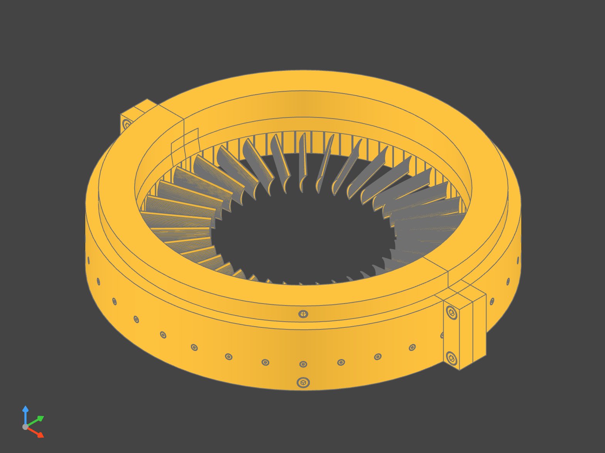

# TurboDesigner
the open-source turbomachinery designer 
<p>
    <a href="https://discord.gg/H7qRauGkQ6">
        </a>
</p>


<p>Axial Shaft</p>


<p>Axial Stage Casing</p>

# About
Turbodesigner is a tool that given [parameters](https://github.com/Turbodesigner/turbodesigner/blob/main/tests/designs/mark1.json) such as pressure ratio and mass flow rate can generate designs using mean-line design, blade flow analysis, and at the end generate a CAD model that can be exported to STL and STEP files.

Currently this generates axial compressors and with further tweaks axial turbopumps for liquid rocket engines

# Setup
```
pip install --pre cadquery
pip install -r requirements.txt
pip install jupyter-cadquery==3.4.0 cadquery-massembly==1.0.0rc0 # for viewing in Jupyter
```

# Help Wanted
Right now there are some items such as verifying calculations, CFD analysis, and adding additional logic for blade analysis. View [Projects](https://github.com/orgs/Turbodesigner/projects/1) tab for specific asks. Please join the [Discord](https://discord.gg/H7qRauGkQ6) for project communications and collaboration.
